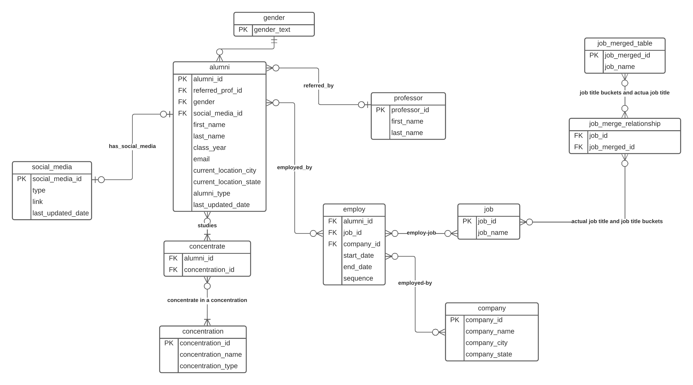

# Why Brandeis Career

While I was working as an office assistant at Brandeis University, I was assigned to collect, clean, and visualize all CS alumni's data, including their majors and their job history (companies and the corresponding employment duration). We spent six months just on collecting all the data and put it into a large Google Sheet file, and then we spent an entire semester on cleaning it. 

We had a large team and without a clear documentation, different people had different habit of recording the data. It turns out that the python code we wrote only works for one semester, and then when a new group of office assistants steps in, it breaks! They'll need to take a deeper look into the code to figure out how to make the cleaning process work. Plus, Google Sheet is too bad to handle a large amount of data.

Because I'm taking Introduction to Database and User Interface Design this semester, I think I can probably advance this whole process into a new stage.

I thus initiate **Brandeis Career**, a project that will enhance the experience of data collection, data cleaning, and data visualization not only for office assistants, but also for the department, faculty members, and the entire Brandeis CS Community.

# What is Brandeis Career

## Three Interfaces

**Brandeis Career** contains three parts: 

- a *backend MySQL database* that is efficient for organizing all the alumni data and scalable for new office assistants to step in and easily Create, Read, Update, and Delete data records if they have prior SQL or python knowledge (`pymysql` or `sqlalchemy`).
- a *backend Web GUI* that has proper access control for office assistants to visually interact with the database (Create, Read, Update, and Delete). They don't need any programming knowledge when using the Web GUI. It also allows the department staff and faculty members to view the data and perform any high-level operations.
- a *frontend Web GUI* that allows any Brandeis student to view the alumni's career trends (bar graph, pie graph... any data visualization tools) or even reach out to alumni themselves.

## How Brandeis Career Benefits the Whole Brandeis Community

For office assistants, they don't need any prior programming knowledge to interact with the database (of course you will need it if you want to contribute to the project), and their interactions are set to be uniform and consistent from generation to generation, so the next group of OAs won't need to worry about any hereditary matters.

For department staff, it will minimize the costs of rebuilding stuff again and again once the whole system is set. The staff can also easily view the whole database and perform any high-level data operations, like data visualizations, if they'd like. Like the staff, professors will also be benefited when they are wondering which company a specific student goes to or should they offer a new course based on the career trends.

For Brandeis students, besides what's been established by Hiatt Career Center, Brandeis Career is the first attempt to summarize all Brandeis CS students' alumni data and try to visualize the trends. If students are wondering which companies they should apply to or which company has a lot of Brandeis alumni, they can take a look at Brandeis Career.

# Behind Brandeis Career

## Backend MySQL database

The alumni database is developed using MySQL. The reason I choose MySQL over other database is relational database is just like the tabular data we interact with daily, and MySQL is a relatively stable service to use.

## Backend Framework

I'm still deciding between whether to use flask, django, or Node.js to develop the Web GUI. I'm currently inclined to choose flask because that's what I'm most familiar with, but Node.js might also be a good idea since it's been taught at Brandeis in recent years.

## Frontend Framework

There isn't a lot of frontend work involved, so I will probably just go with flask's template system + JQuery. If in the future it emerges to a customer-facing application, I will choose between React.js or Vue.js then.

# Database

I've created a Database Schema draft using Crow's Foot Notation.

In the graph, `PK` stands for Primary Key, and `FK` stands for Foreign Key.

It will be constantly updating according to department's needs.
