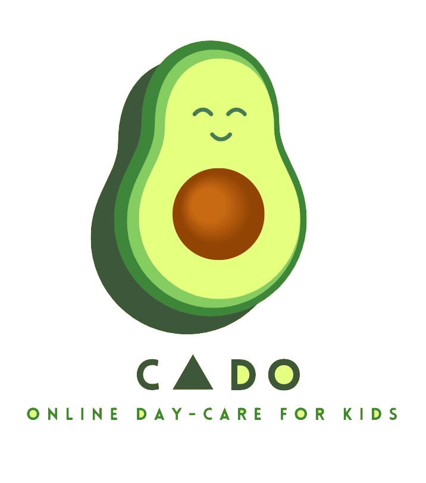
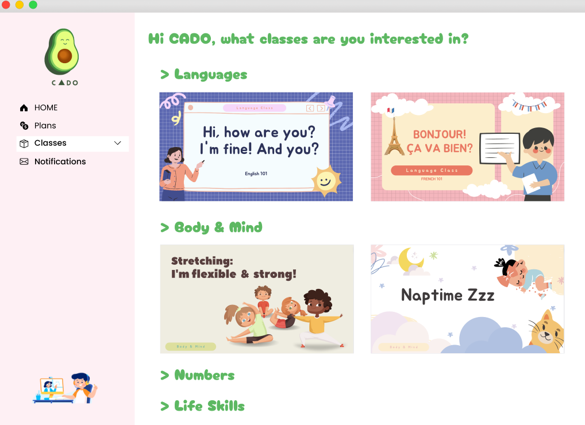
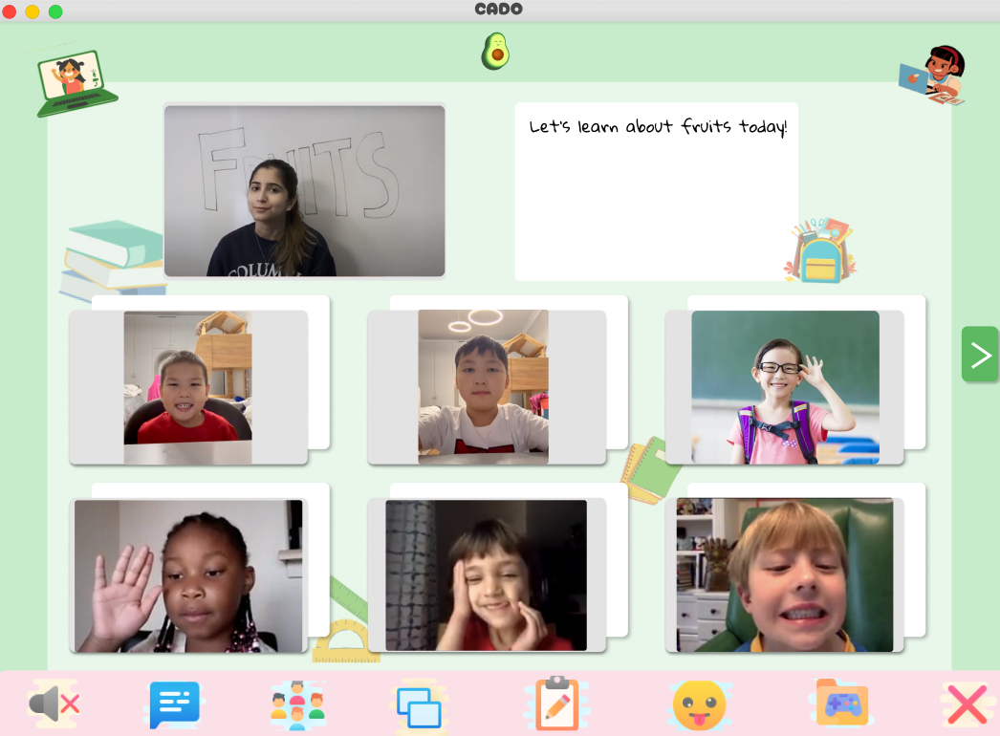
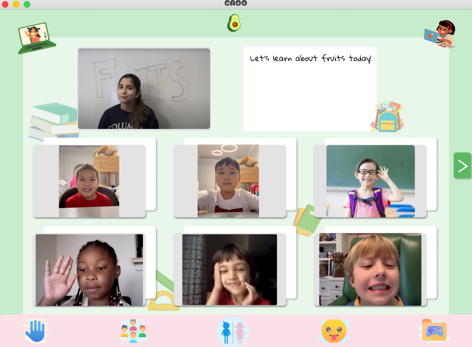



# Story

Working from home as a mother can feel like paradise. But, you have back-to-back meetings, an upcoming product release, and presentations to upper management with your children crying and running around. How do you concentrate? 

**CADO** aims to provide an online daycare to keep your children busy and distracted on our cloud meeting platform designed for kids. You won’t need to worry about balancing work and your children’s education because through interactive activities, we teach them life skills, language courses, and simple math - you choose it! 

Boost your productivity today and keep distractions away! 

# Problem Statement

For **remote working** parents with children **aged 1-5**, **mothers** struggle to focus on their jobs because they lack a productive and undistracted environment at home.

# Primary Research

## Children

- *"If my kids were doing homework at a certain time, I knew I would need to make time to help them."*
- Need extra time to help children with homework or other chores
- Need something to keep their children busy
- Want their children to feel cared for at home

## Self

- "The only 'me' time I could possibly have is either in early morning or at late night... When I’m working from home, my kid, work, and trifles would keep me spinning and I have no idea which one to prioritize."
    - Want to have focus time for themselves
    - Need to set priorities for their tasks
    - Need to time to reflect and self-prioritization
- *"The challenge for me as a working parent is that there were no concrete lines of nine to five."*
    - Need flexibility when creating a daily routine/schedule
    - Want to feel safe using time off

## Work

- *"Sometimes, I feel like I am not putting in my full effort as an employee and as a mother. It is hard to balance it all, and I have to give up something."*
    - Want to produce quality work for job
    - Want to feel connected to office/team
    - Want to work efficiently

## Environment

- *"I had to coordinate with my husband. There was no way I could simultaneously wear four hats at the same time. I'm an entrepreneur. I'm a wife. I cook and clean the house. I take care of the kids."*
    - Need to know division of labor at home
    - Want food that is easy to prep and cook so do not waste time
    - Want other parent to help out more with household chores

> Seeking an undistracted work-from-home environment, mothers want to focus on their jobs as well as have a balance between taking care of themselves and their children.

# Prototype

## Figma Design

Mother's View:

Instructor's View:

Kid's View

## Incorporate User Feedback into Design

| User Feedback        | P/N   | Reflected in our design |
| ----------- | :-----------: | ----------- |
| Love courses that teach valuable skills and languages        | Positive         | Instructor-led language courses, simple maths, life skills, team-working skills; napping classes, exercise courses |
| Can prepare kid for technology     | Positive          | User-friendly interface specifically designed for kids |
| Too much screen time     | Negative          | Limit to 20 minutes-ish per class with breaks in-between; Send alerts to parents about screen time |
| Kids get bored     | Negative          | More body-involved classes like yoga, napping, stretching, jigsaw, exercises, etc. (not only academic!) |
| Will need to find a quiet space for the child to sit and "take meetings" as well     | Negative          | Provide the option to bundle the courses with a kid’s headphone which suit the kid and provide the quietness for mothers |



# Critiques

***Will the kids be interested? How would you keep them involved? Wasn’t there a lot of problems of keeping kids engaged through visual platforms during the pandemic?***

- Yes! Kids will remain engaged through the offering of different types of classes in addition to academic, including:
    - Body-involved classes like yoga, dance, & exercise
        - Exercise is a great way to activate the brain and a child's ability to comprehend and memorize. 
    - Life skills classes such as art/shapes, safety, etiquette, & playing chess
- Short class time of about 20-25 minutes with inspirational instructors to accommodate short attention span of 9-18 min of kids age 3-6
- CADO will also be able to provide classes with at-home kits like puzzles and building castles for hands-on activities 
Buddy zone feature encourages co-learning and building of social skills
- During the pandemic, visual platforms for academic education were not the norm for kids, which is why they struggled. The introduction of CADO with its fun courses at such a young age will help kids acclimate to this “new normal” early on and ensure success in school in the future.  

***Would moms be okay with the amount of screen time this involves?***

- **Awareness**: We will alarm parents about how much screen time children are spending on our app, so it’s up to the parent to decide;
- Studies find children from age 2 to 5 are already spending more than two hours a day looking at screens. Based on customer feedback, moms would love to make **these hours more valuable** by taking online classes **instead of just browsing Tiktok/mobile games/Youtube**;
- We provide not only academic content that requires the children to pay attention to the screen, but also napping classes, exercises, puzzles, or building classes that don’t require a lot of screen time;
- According to our customer feedback, moms are mostly okay with children resting between 20 minutes classes rather than always looking at the screen.
