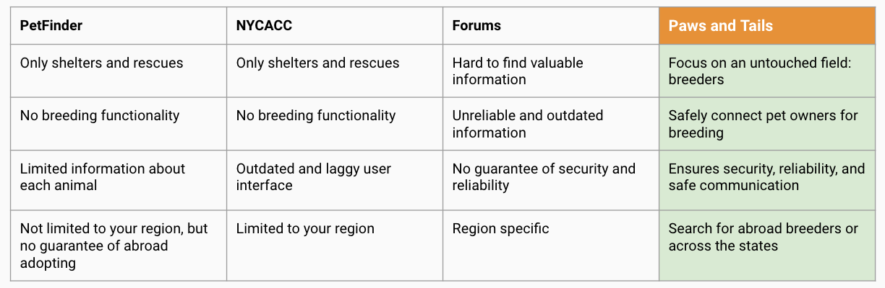



# Story

As a pet lover, I've been wanting a Ragdoll for so long. During my search for a cat, I figured out that although there are plenty of websites connecting shelters with petfinders, there isn't a single successful platform connecting breeders with petlovers.

Right now, if you want to find a breeder, you have to go online and search for "best Ragdoll breeders in New York City". This will lead you to watch tons of bad-designed websites, send countless emails, do many interviews, pay deposit fees, and finally - you have to wait for six months for the litter.

If you want a cat right away, you may have to search for out-of-state breeders or even abroad breeders. You might ask: "How do I trust them? How can I make sure I will receive my pet after paying the money?"

Thus, during my Engineering Software as a Service class, I developed Paws and Tails - a website that connects breeders and petfinders.

# Customer Analysis

## Pain Points

- Lack of reliability of breeder and pet information
- Lack of effective communication tools - still phone/email based
- Lack of access to overseas or faraway breeders
- New petowners need advice on raising animals
- Hard to find pets other than dogs & cats in the current market

## Customer Needs

- Already got tons of websites on shelters, NO good websites that connects breeders and future pet owners; or breeders and breeders
- Centralized marketplace for finding breeders and making purchases, not “word-of-mouth”;
- Safe, secure internal communication tools;
- Communicating with breeders from a different region. 

# Why Paws and Tails

- A comprehensive and reliable resource for pet lovers
Useful functionality such as sorting and filtering and chat functionality with breeders
- Access to both existing and forthcoming (with anticipated birth) pets
- Connect between pet owners for breeding
- Connect pet lovers with faraway pet owners

# Competitor Analysis

# Technologies

## Tech Stack

Frontend: Vanilla Javascript

Backend: Ruby on Rails

Database: Amazon RDS, SQLite3

**Behavior Driven Development**: Cucumber.io

**Test Driven Development**: Rspec (unit testing)

Deployment: Docker, Heroku

## Supported Features

- Animal searching by city and country, sorting, filtering
- Join animal liter waitlist
- Breeder searching
- Dashboard for breeders to manage waitlist
- In-app messaging between breeders and petfinders
- User signup, login system

# Links

[GitHub source code](https://github.com/tianqizhao-louis/paws-and-tails-ruby)